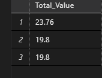
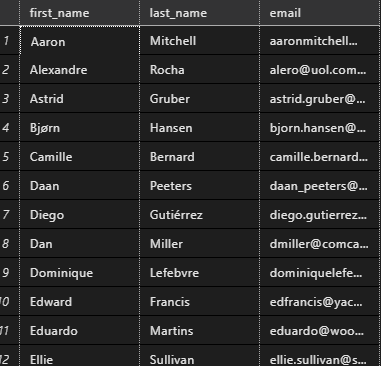
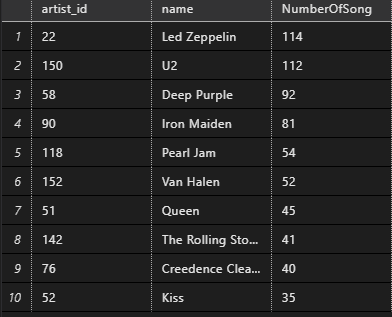
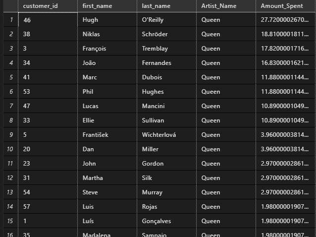
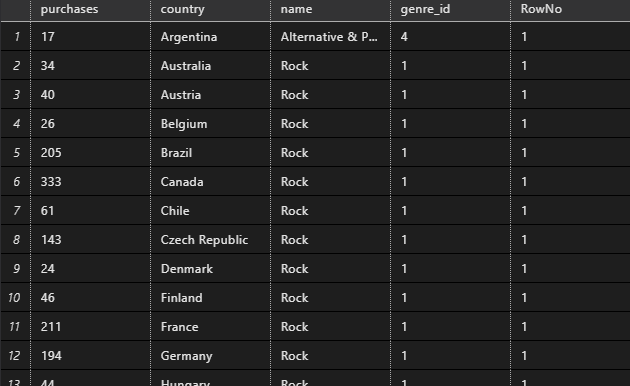

# Music Store - Data Analysis using SQL

## Project Demo

## Schema 

## Tools

- MS SQL
- SQL Server
- VS Code
- SSMS(SQL Server Management Studioi) 

## SQL Query

There are 3 sql files where all sql queries are written. look at the below lists:

- Query Set 1 [View](Query_SET_1.sql)
- Query Set 2 [View](Query_SET_2.sql)
- Query Set 3 [View](Query_SET_3.sql)

Sample Question - [click here](Sample-Questions.pdf) to see the questions. 

## Data Source

There are multiple table. Raw data (.csv files) are imported into SQL Server and represenred as Tables. Schema is shown above [Schema](#schema) section.

I have created database named "*DAMusicPlaylist*" under which all tables are there.

here 👇 is structure how database and tables are listed in SQL Server:

I have applied ***Join***, ***Union***, ***CTE(Common Table Expression)***, ***Group By***, ***Order By*** etc. on dataset based on that analyze data and have written SQL queries to get outcomes efficiently. Tables are ;ike below:

1. Album [view Table](./Dataset/album.csv)
2. Artist   [view Table](./Dataset/artist.csv)
3. Customer [view Table](./Dataset/customer.csv)
4. Employee [view Table](./Dataset/employee.csv)
5. Genre [view Table](./Dataset/genre.csv)
6. Invoice Line [view Table](./Dataset/invoice_line.csv)
7. Invoice [view Table](./Dataset/invoice.csv)
8. Media Type [view Table](./Dataset/media_type.csv)
9. Playlist Track [view Table](./Dataset/playlist_track.csv)
10. Playlist [view Table](./Dataset/playlist.csv)
11. Track [view Table](./Dataset/track.csv)

## Sample Output

I have shown some of outputs here: 👇 

- Which countries have the most Invoices?

    

---

- What are top 3 values of total invoice?

    

----

-  Write query to return the email, first name, last name, & Genre of all Rock Music listeners. Return your list ordered alphabetically by email starting with A.

    

---

- Write a query that returns the Artist name and total track count of the top 10 rock bands.

    

---

- Find how much amount spent by each customer on artists? Write a query to return customer name, artist name and total spent.

    

---

- Write a query that returns each country along with the top Genre. For countries where the maximum number of purchases is shared return all Genres.

    

