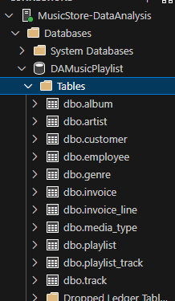
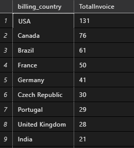

# Music Playlist - Data Analysis using SQL

## Project Demo

## Schema 

## Tools

- MS SQL
- SQL Server
- VS Code
- SSMS(SQL Server Management Studioi) 

## SQL Query

There are 3 sql files where all sql queries  are written. look at the below lists:

- Query Set 1 [View](Query_SET_1.sql)
- Query Set 2 [View](Query_SET_2.sql)
- Query Set 3 [View](Query_SET_3.sql)

## Data Source

There are multiple table. Raw data (.csv files) are imported into SQL Server and represenred as Tables. Schema is shown above [Schema](#schema) section.

I have created database named "*DAMusicPlaylist*" under which all tables are there.

here 👇 is structure how database and tables are listed in SQL Server:

I have applied ***Join***, ***Union***, ***CTE(Common Table Expression)***, ***Group By***, ***Order By*** etc. on dataset based on that analyze data and have written SQL queries to get outcomes efficiently. Tables are ;ike below:

1. Album [view Table](./Dataset/album.csv)
2. Artist   [view Table](./Dataset/artist.csv)
3. Customer [view Table](./Dataset/customer.csv)
4. Employee [view Table](./Dataset/employee.csv)
5. Genre [view Table](./Dataset/genre.csv)
6. Invoice Line [view Table](./Dataset/invoice_line.csv)
7. Invoice [view Table](./Dataset/invoice.csv)
8. Media Type [view Table](./Dataset/media_type.csv)
9. Playlist Track [view Table](./Dataset/playlist_track.csv)
10. Playlist [view Table](./Dataset/playlist.csv)
11. Track [view Table](./Dataset/track.csv)

## Sample Output

I have shown some of outputs here: 👇 

---

----

---

---

---

